**Laporan Praktiukum JavaScript**

**Aplikasi To-Do List** 

**Nama : Muhammad Zaidan Ahbab**

**NPM : 4523210081**

**Mata Kuliah : Praktikum Desain Web** 

**Tanggal : 1 Oktober 2024**

Dosen Pembimbing :

**Adi Wahyu Pribadi , S.Si., M.Kom.**

**FAKULTAS TEKNIK
UNIVERSITAS PANCASILA JAKARTA**

**2024** 

1. **Pendahuluan** 

Dalam praktikum ini, tujuan utamanya adalah membuat aplikasi To-Do List menggunakan JavaScript, HTML, dan CSS. Aplikasi ini memungkinkan pengguna untuk menambah, menghapus, dan menandai tugas sebagai selesai. Selain itu, aplikasi ini dilengkapi dengan fitur filter untuk melihat tugas yang aktif, selesai, atau semua tugas. 

Aplikasi ini dirancang untuk memungkinkan pengguna menambahkan tugas, menandai tugas sebagai selesai, serta menghapus tugas dari daftar. Implementasi fitur-fitur tersebut akan menguji pemahaman mahasiswa terkait manipulasi DOM, penanganan event, penggunaan class dan objek, serta penerapan fungsi. 

Dasar teori yang digunakan dalam praktikum ini meliputi manipulasi DOM (Document Object Model) menggunakan JavaScript, event handling, serta penerapan class dan fungsi untuk mengatur data dan tampilan aplikasi.

2. **Langkah Pengerjaan** 
1. **Persiapan File HTML** 

Dibuat file HTML yang berisi struktur dasar aplikasi, seperti input tugas, tombol untuk menambah tugas, serta area untuk menampilkan daftar tugas. Berikut adalah screenshot dan potongan kode dari index.html: 

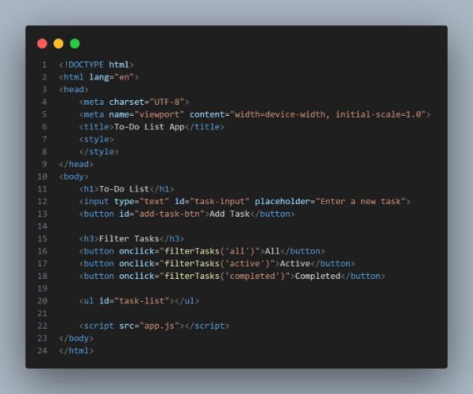

2. **Menyusun CSS** 

CSS digunakan untuk memberikan gaya pada elemen-elemen HTML seperti input, tombol, dan daftar tugas. Berikut source code di dalam node style : 

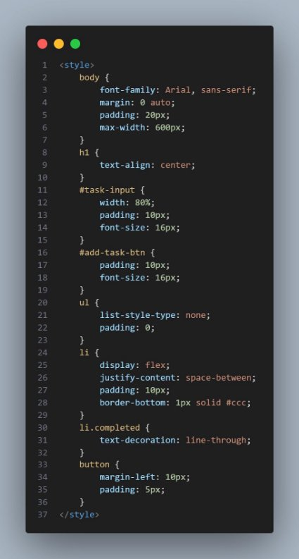

3. **Implementasi JavaScript** 

JavaScript digunakan untuk menambahkan fitur dinamis seperti penambahan, penghapusan, serta pemfilteran tugas. Berikut adalah tahapan yang dilakukan: 

1. **Class dan Object untuk Tugas** 

   app.js → class untuk merepresentasikan tugas yang memiliki properti name dan completed. 

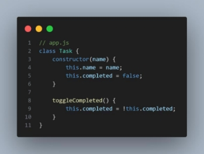

2. **Menambahkan Tugas** 

   Dengan menggunakan fungsi addTask, tugas baru bisa ditambahkan ke dalam daftar. Kode untuk fungsi ini adalah sebagai berikut: 

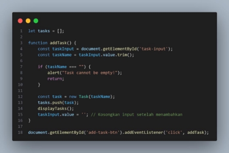

3. **Menampilkan Tugas** 

   Fungsi displayTasks digunakan untuk menampilkan daftar tugas dalam elemen ul. Setiap tugas memiliki checkbox untuk menandai selesai, serta tombol hapus. 

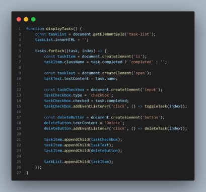

4. **Menandai Tugas Selesai dan Menghapus Tugas** 

   Fitur Menandai Tugas Selesai memungkinkan pengguna untuk menandai suatu tugas sebagai "selesai" atau membatalkan tanda selesai. Dan fitur Menghapus Tugas memungkinkan pengguna untuk menghapus tugas dari daftar. 

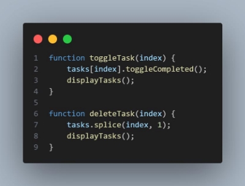

5. **Filter Tugas Berdasarkan Status** 

   Pengguna dapat memfilter tugas berdasarkan status: **Semua (all)**, **Aktif (active)**, atau 

   **Selesai (completed)**. 

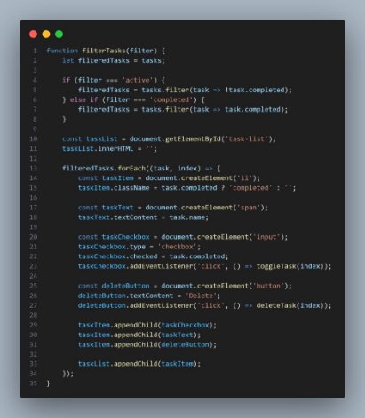

3. **Struktur dan Penjelasan Kode** 
1. **Class Task** 

   Class ini digunakan untuk menyimpan nama tugas dan status apakah tugas sudah diselesaikan atau belum. Class ini juga memiliki metode untuk mengubah status tugas. 

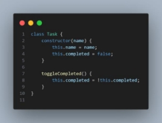

2. **Fungsi-fungsi Utama** 
1. **addTask :** Menambah tugas baru ke dalam array tasks dan menampilkan ulang daftar tugas. 

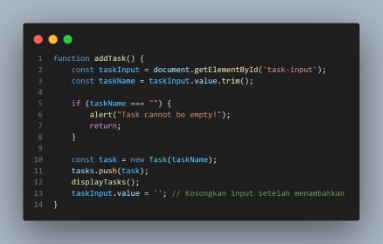

2. toggleTask: Mengubah status tugas dari belum selesai menjadi selesai, atau sebaliknya. 

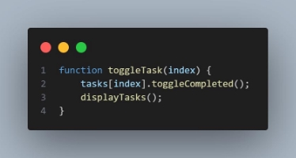

3. deleteTask: Menghapus tugas dari daftar. 

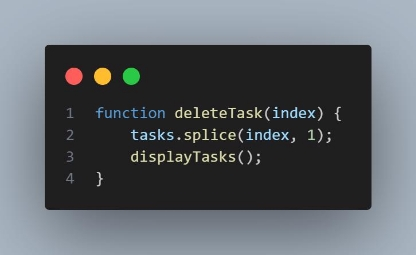

4. filterTasks: Memfilter tugas berdasarkan status (semua, aktif, atau selesai). 

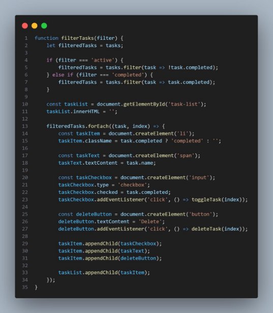

4. **Hasil Ujicoba** 

   Setiap fitur aplikasi berhasil diimplementasikan sesuai rencana: 

- **Penambahan Tugas**: Tugas bisa ditambahkan menggunakan input. 

  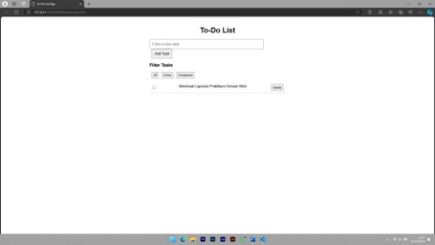

- **Tandai Tugas Selesai**: Checkbox di sebelah tugas bisa digunakan untuk menandai tugas sebagai selesai. 

  

- **Penghapusan Tugas**: Tombol "Delete" berfungsi untuk menghapus tugas dari daftar. 

  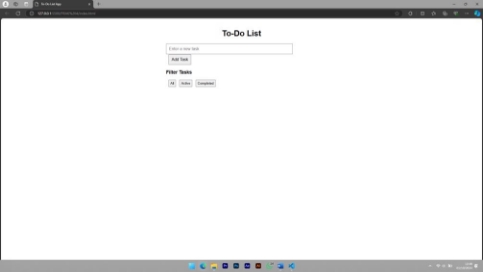

- **Filter Tugas**: Pengguna bisa memfilter untuk melihat tugas aktif, selesai, atau semua tugas. 
- **All** 

  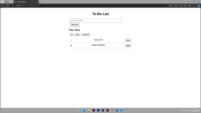

- **Active** 

  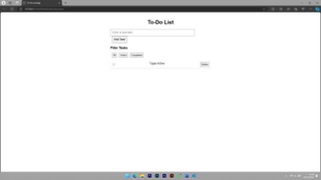

- **Completed** 

  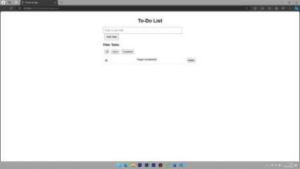

5. **Kesimpulan** 

Aplikasi To-Do List ini berhasil dibuat dengan menerapkan dasar-dasar JavaScript seperti class, manipulasi DOM, dan event handling. Setiap fitur berjalan dengan baik, mulai dari penambahan tugas hingga filter tugas. 
